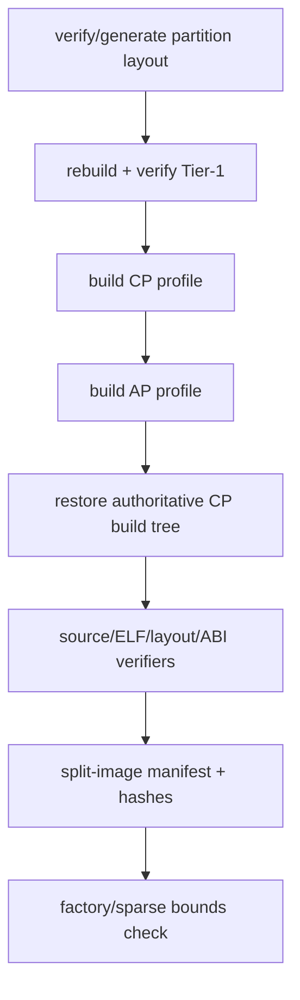
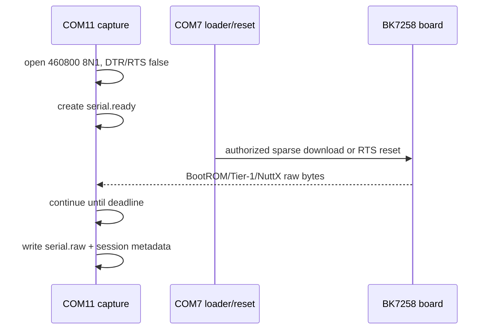

> **事实截止日期**：2026-08-04
> **权威来源**：[BK7258 build/flash/debug SOP](../nuttx-port/bk7258-build-flash-debug-sop.md)、[项目运维](../../../memory/OPERATIONS.md)、[Windows/WSL2通用调试工具](../../../tools/windows-hardware-debug/README.md)
> **证据边界**：构建与只读检查可复现；任何Flash erase/program、factory rewrite、PSRAM write或额外reset仍需要对应授权。本章不是一次新的板写授权。

> ⚠️ **SUPERSEDED / NON-RUNNABLE**：本章旧 profile-pair 命令仅保留为
> 历史证据，禁止执行，也不要重建已删除的 `configs/` 目录。当前 canonical
> product、validation-suite 和 materializer 入口如下；它们先生成/审计
> host-only role view，不授权 Flash：
>
> ```sh
> python3 tools/bk7258/bk7258_framework.py build-plan \
>   --product t5_board_bringup --out <build-root>/bk7258-build-plan.json
> python3 tools/bk7258/bk7258_framework.py validation-check
> python3 tools/bk7258/materialize_product_profiles.py \
>   --plan <build-root>/bk7258-build-plan.json \
>   --seed-root board/bk7258/configs --output <build-root>/configs \
>   --make-defs board/bk7258/scripts/Make.defs
> python3 tools/bk7258/bk7258_isolated_executor.py prepare \
>   --product t5_board_bringup --build-root <build-root> \
>   --out <build-root>/execution.json
> ```

# 10 构建、下载、调试与证据

## 1. 先分清四个动作

| 动作 | 是否改变开发板 | 正常权限边界 |
|---|---|---|
| build/verify | 否 | 可直接执行 |
| UART capture | 否 | 可直接执行，但不得抢占用户串口 |
| J-Link memory read | 通常不写目标数据，但连接可能影响运行 | 先冻结命令与no-reset边界 |
| Flash/PSRAM write、reset | 是 | 需要明确范围/动作授权 |

“能构建”不等于“能烧录”，“Flash PASS”也不等于“功能PASS”。

## 2. 标准产品解析与隔离构建

产品 ID 是唯一的配置入口；不要把 CP/AP profile 名称当作产品选择器。
需要运行 host-only 的四角色流程时，在 `prepare` 后按 manifest 执行
`materialize-sources`，再由单独授权的 `compile-runtime` 产生只读证据：

```bash
cd <workspace-root>/contest2026_135_yongwangzhiqian
python3 tools/bk7258/bk7258_isolated_executor.py \
  materialize-sources --manifest <build-root>/execution.json
python3 tools/bk7258/bk7258_isolated_executor.py \
  compile-runtime --manifest <build-root>/execution.json \
  --authorize-compile
```

| 行 | 含义 | 为什么显式写 | 错了会怎样 |
|---|---|---|---|
| `cd <workspace-root>/contest2026_135_yongwangzhiqian` | 进入项目根 | 脚本使用固定相对布局 | 找错NuttX/apps/contest |
| `--product ...` | 选择 canonical product | 绑定板、boot、partition 和 SDK | 解析结果不匹配即拒绝 |
| `validation-check` | 校验 suite catalog | 防止 suite 资源/行为漂移 | 不声明硬件 PASS |
| `materialize_product_profiles.py --plan ...` | 渲染临时 role view | 只消费 canonical IR | 不恢复旧 profile |
| `isolated_executor.py` | 审计 source snapshot/role roots | 每个角色隔离 | 不执行 Flash/sign/package |

对于 normal N15 构建，产品 plan 强制绑定 v3.1.1.9，并保证 OTA
selection/write gates 关闭。需要验证功能时选择 validation-suite overlay；
suite 只携带资源/行为声明，不注入 Kconfig；配置由保留 seed 经 menuconfig/
Kconfig 生成最终 .config。

## 3. Builder内部发生什么



成功输出至少要回答：

- 实际用了哪个CP/AP profile；
- SDK bundle checksum是否匹配；
- Boot/CP/AP ELF是否无undefined symbol；
- vector、XIP、SRAM、RPTUN、PSRAM、partition范围是否通过；
- root CP artifacts是否与manifest逐byte相同；
- normal `all-app.bin`是否仍为Boot+CP，而不是偷偷混入AP/OTA candidate。

## 4. 为什么manifest比“记住地址”可靠

`bk7258-dual-image.json`记录每个segment的：

- raw physical start/end；
- 文件路径、size、SHA-256；
- logical/XIP信息；
- layout ID和profile identity。

下载时应从本次manifest取exact range，不能复制旧聊天、旧README或上一个layout的长度。N15迁移前后的sparse image不可互换。

## 5. 当前硬件端口拓扑

| 设备 | 当前映射 | 用途 |
|---|---|---|
| CH342-A | COM7 | BK loader/download、已验证150 ms RTS reset |
| CH342-B | COM11 | firmware UART，460800 8N1 |
| J-Link SWD | Cortex-M33 target | 寄存器/内存/ELF诊断 |

COM7和COM11都来自USB转串口芯片，因此USB必须保留才能继续供电和保留串口。J-Link与USB可同时供电；断J-Link target power时USB仍可能供板，所以不能记为power cut。J-Link RST物理连到board RST，但具体Commander命令/reset type仍需单独证明。

每次session前重新枚举端口，不能把COM7/COM11当永远不变的Windows事实。

## 6. 为什么先开串口、再触发下载/复位

正确证据时序：



如果先reset再开COM11，最关键的`BClk`、boot error或第一次乱码已经丢失。

## 7. 一份可审计的session应该有什么

| 文件 | 用途 |
|---|---|
| `artifacts.sha256` | profile、size、mtime、hash，绑定本轮binary |
| `download.log` | loader完整stdout/stderr |
| `serial.ready` | 证明capture先于控制动作就绪 |
| `serial.raw` | 原始UART bytes，最高权威 |
| `serial.txt` | 容错解码，方便阅读但不替代raw |
| `serial-capture.stdout.log` | capture工具自身状态 |
| `summary.txt`/`session.json` | 时间、端口、动作、正负marker、判定 |
| `jlink-*.log` | 仅在批准J-Link诊断时存在 |

原始证据和summary必须同时保存。只保留一张终端截图无法复核字节、时间顺序或遗漏的reset。

## 8. 启动marker怎么定位层次

| 最后看到的marker | 已通过 | 下一调查层 |
|---|---|---|
| 无字节 | 什么都不能证明 | COM11占用、供电、baud、reset时序 |
| `BClk`，无Tier-1 | BootROM/physical reset出现 | boot image/magic/CRC |
| `u_bootloader enter`，无`JMP` | team boot开始 | partition/vector/magic/WDT |
| `JMP`，无NuttX early | handoff执行 | VTOR/MSP/cache/MPU/CP image |
| NuttX early，无NSH | CP `__start`进入 | FPU/SysTick/scheduler/console |
| `PASS_NSH` | CP shell可用 | 继续跑本profile功能gate |
| AP READY但service fail | AP启动可用 | RPTUN/BT/PSRAM具体service |

`PASS_NSH`从来不代表整个双镜像、Bluetooth或OTA通过。

## 9. 发送NSH命令的只读采集示例

```bash
cd /home/lijian/project/open-vela
PS1=$(wslpath -w contest2026_135_yongwangzhiqian/tools/bk7258/capture_windows_serial.ps1)
OUT=$(wslpath -w /home/lijian/project/open-vela/logs/apctl-status.raw)
powershell.exe -NoProfile -ExecutionPolicy Bypass \
  -File "$PS1" -Port COM11 -Baud 460800 -DurationSec 6 \
  -OutputFile "$OUT" -Command 'apctl status'
```

| 行 | 含义 | 风险/注意 |
|---|---|---|
| `cd` | 固定workspace根 | 路径错误会找错脚本 |
| `wslpath -w` | 把WSL路径交给Windows PowerShell | 不转换会找不到文件 |
| `OUT=...` | 固定raw输出 | 不要覆盖需保留证据 |
| `powershell.exe...` | 调Windows串口API | COM11不能被MobaXterm占用 |
| `-Port/-Baud` | 当前firmware console参数 | 端口需先重新枚举 |
| `-Command` | 只发送`apctl status` | 换成mutation命令需新权限 |

常用只读命令：`apctl status`、`uname -a`、`ps`、`ls /dev`、`bkota status`。不要把状态命令与stage/publish/erase命令混在同一自动脚本。

## 10. Flash/read-back特别规则

- normal更新必须sparse写Boot/CP/AP exact segment，保留B、metadata、LittleFS、`usr_config`、reserved和tail；
- factory迁移/重写是破坏性动作，需要fresh authority；
- raw `0x7fa000..0x800000` 永远不在项目写range；
- BKFIL关键区read-back固定115200，连续两次capture必须byte-identical；
- 6 Mbps read已观察到插入128-byte zero block，不能作为bit-exact recovery image；
- loader即使打印success也可能exit code 1，判定应检查完整success marker与verify，不只看进程码。

## 11. J-Link的正确角色

J-Link适合：

- 读CPUID/VTOR/MSP/PSP；
- 读fault status和stacked frame；
- 对照ELF symbol/address；
- 在明确no-reset前提下读取shared telemetry/Flash controller状态。

它不应默认承担：

- cold reset证明；
- power cut证明；
- 未授权PSRAM/Flash写；
- 任意command file；
- 连接后悄悄halt/reset再把结果当自然运行状态。

N15曾发生J-Link写PSRAM第一个byte read-back不一致，说明“命令返回”也不等于transport可靠；必须write/read/compare成功后才能允许后续Flash mutation。

## 12. 状态标签与证据组合

| 标签 | 至少需要什么 |
|---|---|
| implemented | source已落地，不代表运行 |
| source-verified | 对official v3.1.1.9/API/call context逐项复核 |
| host-verified | portable test/negative matrix在host PASS |
| ELF-verified | symbol、section、gate、undefined、地址实际闭合 |
| dry-run-verified | loader/命令生成和range检查，无target mutation |
| board-observed | 板上看到现象，但未完成验收矩阵 |
| board-verified | 绑定artifact + raw log +正负/生命周期/回归gate闭环 |

高层状态可以组合，例如“implemented + source/host/ELF verified”；不能直接跳写board-verified。

## 13. 每次交付前的最小检查表

- [ ] 明确CP/AP profile与SDK v3.1.1.9；
- [ ] bundle checksum通过；
- [ ] stage-specific verifier通过；
- [ ] `git diff --check`通过；
- [ ] official `nuttx/`、`apps/` tracked diff为0；
- [ ] manifest segment与artifact hash冻结；
- [ ] 串口先于reset/download开始；
- [ ] `serial.raw`与session metadata保留；
- [ ] `PASS_NSH`后继续执行功能gate；
- [ ] reset与power cut分开记录；
- [ ] 未越过本轮授权的地址/动作；
- [ ] 不启动会拖慢主机的`BLEDebug.EXE`。
