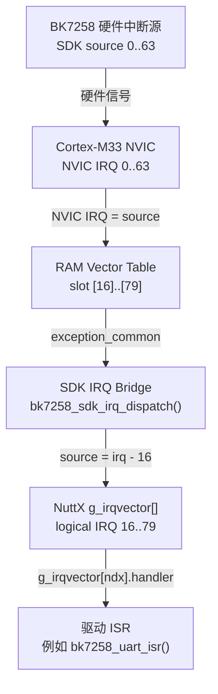

# IRQ/Vector Bridge：从硬件中断到 NuttX ISR

本篇解释 BK7258 的中断如何从硬件到达 NuttX 的中断处理函数。这个链路涉及四层，每一层都有自己的编号系统。理解这些编号之间的映射关系，是排查"中断不触发"问题的基础。板端标签均为来源日期对应的教学快照；当前事实以源码、维护配置和 `$IMPL/docs/verification/bk7258/` 中匹配板型的记录为准。

> **来源记录**
>
> - 教学主题：BK7258 SDK IRQ source → NuttX logical IRQ → RAM vector → ISR 完整链路
> - `$CONTEST` source commit：`c588afbd8e0f1d30723f5076e585673a6ace8a4e`
> - `$WORKSPACE/nuttx` commit：`e02f581e235fc7b527d57ff62b668ce625d139ab`
> - 有效配置来源：2026-07-24 来源快照中的 `$WORKSPACE/nuttx/.config`
> - 最后核对日期：2026-07-24
> - 未覆盖：多核中断路由、完整 NVIC 寄存器手册

## 1. 四层编号系统

BK7258 的中断链路中有四种编号，必须区分清楚：

| 编号类型 | 范围 | 由谁定义 | 含义 |
|---|---|---|---|
| SDK IRQ source | 0..63 | BK7258 SDK `icu_int_src_t` | 芯片内部中断源序号 |
| NuttX logical IRQ | 16..79 | `BK7258_IRQ_FIRST + source` | NuttX 统一 IRQ 编号 |
| Vector table slot | 0..79 | ARM Cortex-M33 架构 | 向量表中的物理位置 |
| NVIC IRQ | 0..63 | ARM Cortex-M33 NVIC | 中断控制器硬件编号 |

关键映射公式：

```text
NuttX logical IRQ = SDK source + BK7258_IRQ_FIRST
                  = SDK source + 16

Vector table slot = NuttX logical IRQ
                  （slot [0]..[15] 是系统异常，[16]..[79] 是外部 IRQ）

NVIC IRQ = SDK source
         （NVIC 从 0 开始计数外部 IRQ）
```

例如 UART1：

```text
SDK source  = 15
NuttX IRQ   = 15 + 16 = 31
Vector slot = [31]
NVIC IRQ    = 15
```

## 2. M-005：中断链路图



### 文本替代

| 层 | 编号 | 入口 | 出口 |
|---|---|---|---|
| 硬件 | SDK source 0..63 | 外设中断状态位 | NVIC 请求线 |
| NVIC | NVIC IRQ 0..63 | 请求线 | 向量表 slot |
| 向量表 | slot [16]..[79] | exception_common | SDK IRQ bridge |
| NuttX dispatch | logical IRQ 16..79 | `g_irqvector[ndx]` | 驱动 ISR |

## 3. 第一层：向量表与 RAM vectors

### 向量表结构

BK7258 的向量表有 80 个条目：

```text
slot [0]      初始 MSP
slot [1]      __start (reset)
slot [2..15]  14 个系统异常
slot [16..63] 48 个低区外部 IRQ
slot [64..65] BK7236 boot magic（不是普通 IRQ）
slot [66..79] 16 个高区外部 IRQ
```

向量表初始位于 flash（`0x02010000`），由 `__start()` 设置 VTOR 指向它。

### CONFIG_ARCH_RAMVECTORS

当前配置启用 `CONFIG_ARCH_RAMVECTORS`。这意味着：

```text
启动时：向量表在 flash，所有 slot 指向 exception_common
         ↓
arm_ramvec_initialize()：
  复制 80 个条目到 RAM
  切换 VTOR 到 RAM 地址
         ↓
运行时：RAM 中的 slot [n] 可以被修改
  irq_attach() 实际修改的是 RAM 向量表中的对应条目
```

RAM vectors 的好处是：驱动可以在运行时替换任意 slot 的处理函数，而不修改 flash。

### boot magic 修复

slot [64] 和 [65] 在 flash 中存储 boot magic `"BK7236\0\0"`，这是 Tier-1 bootloader 验证应用镜像合法性所必需的。但 NuttX 需要这两个 slot 指向 `exception_common` 来处理 IRQ 64/65。

因此 `up_irqinitialize()` 在切换到 RAM 后，用 `arm_ramvec_attach()` 修复这两个 slot：

```c
arm_ramvec_attach(BK7258_IRQ_ETHERNET, exception_common);  // slot 64
arm_ramvec_attach(BK7258_IRQ_SCALE0, exception_common);    // slot 65
```

## 4. 第二层：`irq_attach()` —— 绑定 ISR

驱动通过 `irq_attach()` 把自己的 ISR 绑定到某个 NuttX logical IRQ：

```c
irq_attach(BK7258_IRQ_UART1, bk7258_uart_isr, dev);
```

内部路径：

`nuttx/sched/irq/irq_attach.c:114`

```c
int irq_attach(int irq, xcpt_t isr, FAR void *arg)
{
  int ndx = IRQ_TO_NDX(irq);  // logical IRQ → g_irqvector 索引

  ...

  g_irqvector[ndx].handler = isr;
  g_irqvector[ndx].arg     = arg;

  ...
}
```

`g_irqvector[]` 是 NuttX 的全局 ISR 分发表。当某个 IRQ 触发时，NuttX 从这个表中找到对应的 handler 并调用它。

### `irq_attach()` 做了什么

1. 把 NuttX logical IRQ 转换为 `g_irqvector[]` 索引；
2. 在临界区内更新 `handler` 和 `arg`；
3. 如果 `isr == NULL`，则禁用 IRQ 并重置为 `irq_unexpected_isr`；
4. 不会自动启用 IRQ line——这需要单独调用 `up_enable_irq()`。

### `irq_attach()` 不做什么

- 不配置 NVIC 优先级；
- 不启用 NVIC IRQ line；
- 不配置外设中断使能位；
- 不设置 GPIO 中断路由。

这些都需要驱动自己完成。

## 5. 第三层：SDK IRQ Bridge

BK7258 的 SDK 使用自己的中断注册 API `bk_int_isr_register()`，与 NuttX 的 `irq_attach()` 不兼容。SDK IRQ Bridge 做的转换是：

```text
SDK: bk_int_isr_register(source, sdk_handler, arg)
  ↓
Bridge: 计算 irq = source + 16
  ↓
Bridge: irq_attach(irq, bk7258_sdk_irq_dispatch, NULL)
  ↓
Bridge: g_bk7258_sdk_irq_handlers[source] = sdk_handler
  ↓
Bridge: up_enable_irq(irq)
```

当硬件中断触发时：

```text
NVIC → exception_common → bk7258_sdk_irq_dispatch(irq)
  → source = irq - 16
  → g_bk7258_sdk_irq_handlers[source]()
  → SDK handler 执行
```

Bridge 的意义是让 SDK 驱动（例如 GPIO、I2C、SPI 等）可以使用自己的 `bk_int_isr_register()` API，而不需要直接调用 NuttX 的 `irq_attach()`。

### 数学映射

`$BOARD/chip/cp/bk7258_sdk_irq.c:68`

```c
static int bk7258_sdk_source_to_irq(icu_int_src_t source)
{
  unsigned int index = (unsigned int)source;
  if (index >= BK7258_SDK_IRQ_COUNT)
    return -1;
  return BK7258_SDK_IRQ_FIRST + (int)index;
}
```

以及编译时验证：

```c
_Static_assert(BK7258_SDK_IRQ_FIRST + BK7258_SDK_IRQ_COUNT == NR_IRQS,
               "Stage B gate: SDK source 0..63 must map to IRQ 16..79");
```

这些断言确保映射在编译时就是正确的。

## 6. 第四层：外设中断的三道门

以 UART1 RX 中断为例，完整路径中有三道门必须全部打开：

```text
门 1：外设内部中断使能
  UART1 RX FIFO threshold interrupt enable

门 2：芯片级中断控制器（如果有）
  BK7258 的 on-chip int controller

门 3：Cortex-M33 NVIC
  up_enable_irq(BK7258_IRQ_UART1)
```

三道门中任何一道关闭，中断都不会到达 CPU。

### UART 的具体实现

`$BOARD/chip/common/bk7258_serial.c:298`

```c
static int bk7258_uart_attach(struct uart_dev_s *dev)
{
  return irq_attach(BK7258_IRQ_UART1, bk7258_uart_isr, dev);
}
```

注意 `bk7258_uart_attach()` 只调用 `irq_attach()`，不调用 `up_enable_irq()`。NVIC 使能和外设中断使能都在 `bk7258_uart_rxint()` 中完成：

```c
static void bk7258_uart_rxint(struct uart_dev_s *dev, bool enable)
{
  ...
  if (enable)
    {
      ... 使能外设中断 ...
      up_enable_irq(BK7258_IRQ_UART1);  // NVIC 门
    }
  else
    {
      up_disable_irq(BK7258_IRQ_UART1);
      ... 禁用外设中断 ...
    }
}
```

这是 NuttX UART upper-half 的标准模式：`attach()` 只绑定 ISR，`rxint()` 控制中断使能。

## 7. GPIO 中断的对比

GPIO 中断使用 SDK IRQ Bridge 而不是直接 `irq_attach()`：

```text
SDK: bk_int_isr_register(source56, gpio_sdk_handler, arg)
  ↓
Bridge: irq_attach(56 + 16 = 72, bk7258_sdk_irq_dispatch, NULL)
  ↓
Bridge: g_bk7258_sdk_irq_handlers[56] = gpio_sdk_handler
```

GPIO 中断需要的三道门：

```text
门 1：GPIO 引脚中断配置
  方向、边沿/电平、使能

门 2：芯片级 GPIO → IRQ source 路由
  source56 → NVIC IRQ 56

门 3：NVIC
  up_enable_irq(72)
```

2026-07-27 C1 证据快照记录：

- source56 相关寄存器可操作；
- route bits 可写入并恢复；
- P29 下降沿中断已通过 GPIO lower-half（`/dev/gpio1`）board-verified，回调正常触发。

> **教学案例留存**：早期 C1 开发中曾出现 P29 下降沿回调超时问题。当时通过"分层证据探针"——逐层检查三道门（GPIO 引脚配置 → source56 NVIC 路由 → NVIC 使能）来定位根因。该过程的完整诊断方法论见[GPIO 子系统学习文档](../gpio/01-mental-model.md)，其中包含 C0/C1/C2 三个阶段的分层验证步骤。此处保留这段叙述作为"如何进行分层诊断"的教学案例。

## 8. 历史教学证据示例

| 链路 | 状态 | 证据 |
|---|---|---|
| UART1 RX 中断 | ✅ board-verified | NSH 可以通过中断接收键盘输入 |
| TIMER1 / SysTick | ✅ board-verified | 系统 tick 正常，sleep/usleep 工作 |
| GPIO P9 轮询 | ✅ board-verified | 轮询模式可读取引脚状态 |
| GPIO P29 边沿中断 | ✅ board-verified | GPIO lower-half `/dev/gpio1` 中断回调正常触发 |
| IRQ Bridge (source→NuttX) | ✅ build-verified | 编译时断言通过，TIMER1 源码验证 |
| RAM vectors | ✅ board-verified | 80-logical-slot 架构在板上运行 |

## 9. 排查"中断不触发"的顺序

当一个中断不触发时，按以下顺序检查：

```text
1. 外设是否真正产生了中断状态？
   → 读外设 pending/status 寄存器

2. 外设内部中断是否使能？
   → 检查外设中断使能寄存器

3. 芯片级路由是否正确？
   → 检查 source → NVIC 的路由寄存器

4. NVIC 是否使能了对应 IRQ？
   → 读 NVIC_ISER 寄存器

5. NVIC 是否有 pending 但未执行？
   → 读 NVIC_ISPR 寄存器

6. RAM vector slot 是否指向正确的处理函数？
   → 读 g_ram_vectors[irq]

7. g_irqvector[ndx].handler 是否已绑定？
   → 检查 irq_attach() 是否被调用

8. ISR 是否执行了但没有唤醒上层？
   → 检查 dispatch count 和 callback count
```

当前 C0/C1/C2 的 GPIO lower-half 实现正是按此顺序逐层验证并最终打通了 P29 中断链路。完整的验证过程和诊断方法论见 [GPIO 子系统文档](../gpio/01-mental-model.md)。

## 10. 自测题

1. BK7258 的 SDK source 15 对应的 NuttX logical IRQ 是多少？
2. `irq_attach()` 是否会自动启用 NVIC IRQ line？
3. 为什么需要 SDK IRQ Bridge？
4. RAM vectors 的好处是什么？
5. GPIO 中断的三道门分别是什么？
6. 如果 `g_irqvector[ndx].handler` 是 `irq_unexpected_isr`，说明什么？

答案：

1. `15 + 16 = 31`。
2. 不会；需要单独调用 `up_enable_irq()`。
3. 因为 SDK 使用 `bk_int_isr_register()` API，与 NuttX 的 `irq_attach()` 不兼容；Bridge 做 source↔logical IRQ 转换。
4. 运行时可以修改向量表中的处理函数，不需要修改 flash。
5. GPIO 引脚中断配置、芯片级 source→NVIC 路由、NVIC 使能。
6. 说明该 IRQ 没有被任何驱动通过 `irq_attach()` 绑定真实 ISR。
